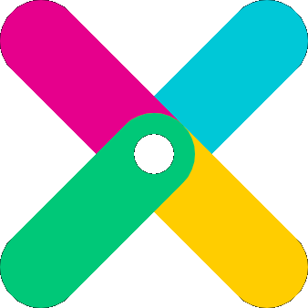

<p align="center">
  
  <br>
  <b>ShotX</b>
  <br><br>
  <a href="https://github.com/vedesh-padal/ShotX/actions/workflows/ci.yml">
    
  </a>
  <a href="https://github.com/vedesh-padal/ShotX/actions/workflows/docs.yml">
    
  </a>
  
  
  
</p>

# ShotX

**A free, open-source screenshot and screen capture tool for Linux — inspired by [ShareX](https://getsharex.com).**

ShotX brings the power of ShareX to the Linux desktop: instant screen capture, region selection with auto-detect, annotation tools, screen recording, image editing, OCR, and upload to multiple destinations — all from a single hotkey press or system tray.

> **Status: Beta** — Core features complete, under active development.

## Features

### 📷 Screen Capture

- **Fullscreen** — capture entire screen or specific monitor
- **Region** — drag-select with auto-detect (windows + AT-SPI2 widgets)
- **Annotation overlay** — annotate directly during region capture
- **Configurable delay** — countdown timer before capture
- **Cursor visibility** — option to include/exclude cursor

### ✏️ Annotation Tools

Built into both the capture overlay and the standalone editor:

- Arrow, rectangle, ellipse, text, freehand draw
- Blur / pixelate, highlight, step numbers
- Eraser, undo/redo, color picker

### 🎥 Screen Recording

- Record any region as **MP4** or **GIF**
- Audio capture (PulseAudio / PipeWire)
- Wayland (`wf-recorder`) and X11 (`ffmpeg`) backends

### ☁️ Upload Engine

- **Built-in**: Imgur, ImgBB, tmpfiles.org
- **Cloud**: Amazon S3 / S3-compatible (Backblaze, MinIO, etc.)
- **Protocol**: FTP, SFTP
- **Custom**: `.sxcu` format compatible with ShareX custom uploaders
- **URL Shortener**: Multiple providers, auto-shorten after upload

### 🎨 Image Editor

- `QGraphicsView`-based canvas with zoom, pan, keyboard shortcuts
- All annotation tools
- Crop & resize with interactive handles
- Effects: borders, shadows, watermarks
- Beautifier: rounded corners, gradient backgrounds, drop shadow
- Combiner: horizontal/vertical image stacking

### 🛠️ Productivity Tools

- **OCR** — extract text from any screen region (Tesseract)
- **Color Picker** — magnifier overlay to pick exact hex color
- **Screen Ruler** — measure pixel distances and boundaries
- **QR Code** — scan from screen/clipboard, generate from text
- **Hash Checker** — file integrity verification (MD5, SHA-1, SHA-256, SHA-512)
- **Pin to Screen** — pin a captured region as a floating always-on-top window
- **Directory Indexer** — generate styled HTML index of a directory tree

### 📜 History & Image History

- **Thumbnail Grid** — browse recent captures edge-to-edge in the Main Window
- **Split-View History** — spreadsheet viewer with live preview panel
- **Search & Filtering** — find captures by filename, extension, or URL
- **Batch Operations** — multi-select and delete files/records in bulk
- **ShareX Formats** — copy links as Markdown, HTML, or plain text codes

### 🖥️ Platform Support

- **Wayland-first** — xdg-desktop-portal D-Bus API for capture
- **X11 fallback** — XCB/Xlib capture backend
- Auto-detection of display server

## System Dependencies

ShotX is a Python application, but some features require system packages:

| Package         | Required For                       | Install (Ubuntu/Debian)          |
| --------------- | ---------------------------------- | -------------------------------- |
| `tesseract-ocr` | OCR text extraction                | `sudo apt install tesseract-ocr` |
| `libzbar0`      | QR code scanning                   | `sudo apt install libzbar0`      |
| `ffmpeg`        | Screen recording (X11)             | `sudo apt install ffmpeg`        |
| `wf-recorder`   | Screen recording (Wayland)         | `sudo apt install wf-recorder`   |
| `grim`          | Screenshot capture (Wayland, sway) | `sudo apt install grim`          |
| `slurp`         | Region selection (Wayland, sway)   | `sudo apt install slurp`         |
| `xclip`         | Clipboard fallback                 | `sudo apt install xclip`         |

> **Note**: On GNOME Wayland, capture uses the xdg-desktop-portal — no extra packages needed for basic screenshots.

## Installation

### From Source (Recommended)

```bash
# Clone the repository
git clone https://github.com/vedesh-padal/ShotX.git
cd ShotX

# Set up with uv (recommended)
uv venv --python 3.12
uv pip install -e ".[all,dev]"

# Run
uv run shotx          # Launch system tray
uv run shotx --help   # See all options
```

### PyPI (Coming Soon)

```bash
pip install shotx
```

## Usage

```bash
# Launch as system tray app (default)
shotx
shotx --tray

# Screen capture
shotx --capture-fullscreen
shotx --capture-region
shotx --capture-window

# Productivity tools
shotx --ocr                       # OCR: select region → text to clipboard
shotx --color-picker              # Pick color → hex to clipboard
shotx --ruler                     # Measure pixel distances
shotx --qr-scan                   # Scan QR from screen region
shotx --qr-generate               # Generate QR from clipboard text
shotx --qr-scan-clipboard         # Scan QR from clipboard image
shotx --pin-region                # Pin region as floating window

# Standalone tools
shotx --hash                      # Open hash checker
shotx --index-dir [PATH]          # Open directory indexer
shotx --edit [IMAGE]              # Open image editor
shotx --history                   # Open capture history viewer

# URL tools
shotx --shorten-url [URL]         # Shorten URL (reads clipboard if no URL)

# Options
shotx --config-dir PATH           # Override config directory
shotx --verbose                   # Enable debug logging
```

## Configuration

Settings are stored in `~/.config/shotx/settings.yaml`. Configuration is managed via the Settings dialog in the Main Window, or edited directly.

Key configuration areas:

- **Capture** — output directory, filename pattern, image format, delay, cursor
- **Upload** — default uploader, API keys, S3/FTP credentials
- **Hotkeys** — global keyboard shortcuts
- **Workflow** — after-capture actions (save, clipboard, upload, open editor)
- **Notifications** — enable/disable desktop notifications

## Architecture

ShotX uses an **event-driven architecture** with domain-specific controllers:

```
main.py (CLI)
  └── app.py (orchestrator)
        ├── CaptureController  — capture workflows
        ├── UploadController   — upload + URL shortener
        ├── ToolController     — editor, hash, indexer
        ├── EventBus           — inter-component signals
        └── TaskManager        — background thread management
```

## Roadmap

- [x] **Phase 1-3** — Core capture, region selection, annotations
- [x] **Phase 4** — Screen recording (MP4/GIF)
- [x] **Phase 5** — Upload engine (6 backends + custom + URL shortener)
- [x] **Phase 6** — Productivity tools (OCR, color picker, ruler, QR, etc.)
- [x] **Phase 7** — Image editor (effects, beautifier, combiner)
- [x] **Phase 8** — Main Window, history, settings, architecture refactoring
- [x] **Phase 9** — Documentation site, initial PyPI packaging, testing, auto-start
- [x] **Phase 10** — Image History grid (1:1 parity) & enhanced History viewer
- [ ] **Phase 11** — Automated release pipeline (CI/CD)
- [ ] **Phase 12** — System packaging (.deb, AppImage, Flatpak)
- [ ] **Future** — Wayland global hotkeys, active window capture, PipeWire recording

## Tech Stack

| Component        | Technology                                   |
| ---------------- | -------------------------------------------- |
| Language         | Python 3.10+                                 |
| GUI Framework    | Qt6 / PySide6                                |
| Config           | YAML (`PyYAML`)                              |
| Screen Capture   | xdg-desktop-portal (Wayland), XCB/Xlib (X11) |
| Recording        | FFmpeg (X11), wf-recorder (Wayland)          |
| Upload           | httpx, boto3 (S3), paramiko (SFTP)           |
| OCR              | Tesseract (`pytesseract`)                    |
| QR Code          | pyzbar, qrcode                               |
| Image Processing | Pillow, QPainter                             |
| D-Bus            | dbus-next                                    |

## Contributing

Contributions are welcome! This project follows clean engineering practices:

- Each commit does one thing
- Clear commit messages following conventional commits
- Feature branches merged via `--no-ff`

```bash
# Run tests
uv run pytest

# Lint
uv run ruff check src/

# Type check
uv run mypy src/
```

## License

GPL-3.0 — see [LICENSE](LICENSE) for details. Same license as ShareX.

## Acknowledgments

- [ShareX](https://getsharex.com) — the original inspiration
- [Flameshot](https://flameshot.org) — a great Linux screenshot tool that paved the way
