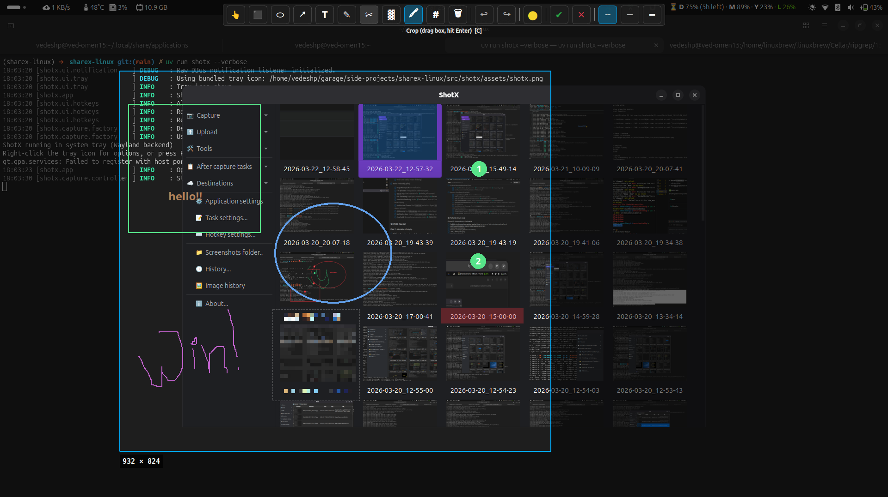

# Annotation Tools

ShotX provides a full suite of annotation tools, available both in the **capture overlay** (annotate during region capture) and the **standalone image editor**.

## Available Tools

| Tool            | Description                                                        | Shortcut |
| --------------- | ------------------------------------------------------------------ | -------- |
| **Select**      | Move or resize existing annotations                                | ++v++    |
| **Arrow**       | Draw arrows with proportional heads                                | ++a++    |
| **Rectangle**   | Draw rectangles (outlined)                                         | ++r++    |
| **Ellipse**     | Draw ellipses (outlined)                                           | ++e++    |
| **Text**        | Add text labels (resizable with ++ctrl+shift+"+"++ / ++ctrl+"-"++) | ++t++    |
| **Freehand**    | Free-form drawing                                                  | ++f++    |
| **Crop**        | Drag a box, then press ++enter++ to apply                          | ++c++    |
| **Blur**        | Pixelate/blur a rectangular area                                   | ++b++    |
| **Highlight**   | Semi-transparent highlight marker                                  | ++h++    |
| **Step Number** | Auto-incrementing numbered circles (right-click toolbar to reset)  | ++s++    |
| **Eraser**      | Remove annotations by clicking                                     | ++x++    |

## Controls

| Action       | Control                     |
| ------------ | --------------------------- |
| Undo         | ++ctrl+z++                  |
| Redo         | ++ctrl+shift+z++            |
| Cancel       | ++escape++                  |
| Confirm      | ++enter++ or ++ctrl+enter++ |
| Change Color | Color picker in toolbar     |

## In Capture Overlay

When `After Capture Action` is set to **Annotate** (the default for region capture), selecting a region transitions into annotation mode:

1. Select a region with the rubber-band tool
2. A toolbar appears with all annotation tools
3. Annotate as needed
4. Press ++enter++ to save or ++escape++ to cancel

## In Image Editor

The standalone editor (`shotx --edit`) provides the same tools with additional capabilities like zoom, pan, crop, and effects. See [Image Editor](editor.md).
