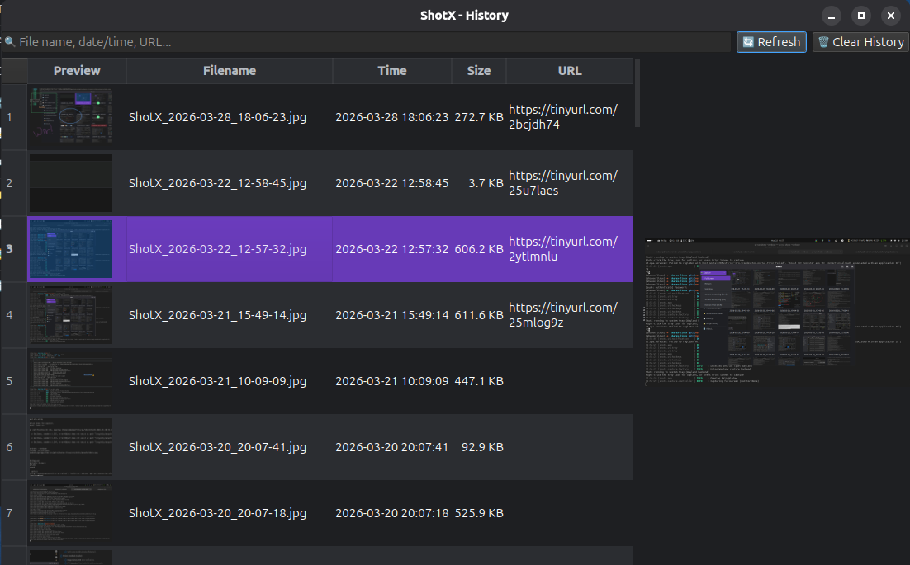

# Capture History

ShotX provides two ways to view and manage your past captures: an embedded **Image History** grid in the Main Window and a standalone **History** spreadsheet viewer.

## Image History (Grid)

The central area of the ShotX Main Window features a responsive thumbnail grid. This view is designed for quick visual browsing of recent captures.

- **Thumbnail Grid**: Displays captures with high-quality thumbnails.
- **Lazy Loading**: Thumbnails are loaded in the background as you scroll, ensuring smooth performance even with thousands of records.
- **Quick Labels**: Filenames are displayed with the `ShotX_` prefix stripped for better readability (e.g., `2024-03-19_23-15-00`).
- **Context Menu**: Right-click any thumbnail to access common actions:
    - **Open**: Open the file in your default viewer.
    - **Copy**: Copy the image itself to the clipboard.
    - **Upload**: Re-upload the file to your default provider.
    - **Edit**: Open the image in the ShotX Editor.
    - **Pin**: Pin this image directly as a floating always-on-top window (no new capture).
    - **OCR**: Extract text from the image.
    - **Delete**: Remove from history or delete the file from disk.

## History Viewer (Spreadsheet)

For advanced management and batch operations, ShotX includes a standalone **History** dialog. This is accessible via the "History..." button in the Main Window or from the System Tray.

- **Split-View Layout**: A spreadsheet-style table on the left with a live image preview on the right.
- **Search Bar**: Quickly filter history by filename, extension, or uploaded URL.
- **Multi-select**: Use `Ctrl+Click` or `Shift+Click` to select multiple rows for batch operations.
- **Batch Deletion**: Remove multiple records from history or delete multiple files from disk simultaneously.
- **Detailed Metadata**: View file size, exact timestamps, and full upload URLs at a glance.

### Tabular Actions

The History viewer provides a comprehensive context menu for integration with other platforms:

- **Copy Submenu**:
    - **Markdown**: Copy as `[Link](URL)`, ``, or ``.
    - **HTML**: Copy as `<a href="...">` or ``.
    - **Paths**: Copy absolute file path, directory path, or just the filename.
- **Open Submenu**: Open the local file, containing folder, or the upload URL in your web browser.

## Database Management

ShotX stores history in a local SQLite database (`~/.local/share/shotx/history.db`). 

- **Privacy**: History is stored locally on your machine and is never synced to any cloud service unless you explicitly use an uploader.
- **Clear History**: Use the "Clear History" button in the History dialog to wipe your entire database (this does **not** delete your actual image files).
